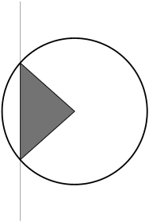
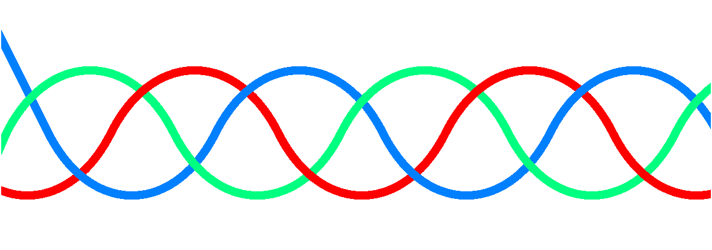

# Laboratorium 1

## Zadanie 1

Zapoznaj się z rozdziałem 2.2 i wykonaj rysunek 2.3. Następnie zmodyfikuj go tak, aby cięciwa była linią pionową, zaś wypełniony był trójkąt wyznaczony przez promienie koła i segment cięciwy.

## Zadanie 2

Narysuj fragment warkocza podobny do tego, który widać na rysunku

Zwróć uwagę na to, że pasy powinny się przenikać  - trzeba je rysować po kawałku. Instrukcje rysowania wykonuj w pętli tak, aby liczba splotów była dowolna.

## Zadanie 3

Korzystając z PyX wykonaj logo naszego Wydziału
Postaraj się wiernie odtworzyć łuki, proporcje grubości linii i ich zakończenia.

