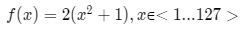

# **Podstawowy algorytm genetyczny**
## **1. Cel ćwiczenia**
Dana jest funkcja:
<!-- $f(x) = 2(x^2+1), x$&#8712;$<1...127>$ -->


Przeszukać przestrzeń i znaleźć taki x, dla którego wartość funkcji jest największa.

## **2. Rozwiązanie**

### ***Algorytm genetyczny***
- Sposób działania algorytmu genetycznego przypomina zjawisko ewolucji biologicznej. Rozwiązanie problemu będzie polegało na poniższych krokach:

<!-- ```plantuml
@startuml
(*)  -down-> [Dla N osobników, wylosuj wartość funkcji f(x)] "Losowanie początkowej generacji"
-down-> [Sprawdź wartość funkcji f(x) dla każdego osobnika] "Ocena przystosowania"
If "Warunek zatrzymania \n(końcowa generacja)" then
-right-> [Tak] "Najlepszy chromosom"
-down-> [Zwróć najlepszego osobnika] (*)
else
-left-> [Nie] "Selekcja"
-left-> [Wybierz chromosomy metodą koła ruletki] "Krzyżowanie i mutacja"
-left-> [Pary chromosomów tworzą nowe pokolenie] "Ocena przystosowania"
@enduml
``` -->


### ***Losowanie początkowej generacji***
Dla N osobników w populacji losujemy ciągi binarne:  

```python
generation = []
for k in range(n):
    generation.append(random.randint(1,128))
```

<div class="page"/>

### ***Ocena przystosowania***
Oceniamy każdego osobnika w populacji za pomocą funkcji:
<!-- $f(x) = 2(x^2+1), x$&#8712;$<1...127>$   -->


```python
def calc_fun(input_data):
    result = []
    for i in input_data:
        temp = []
        temp.append(i)
        temp.append(2*(math.pow(i,2)+1))
        result.append(temp)
    return result
```

### ***Selekcja chromosomów***
Używając aktualnej generacji tworzymy populację rodzicielską za pomocą której utworzymy nowe pokolenie przy pomocy koła ruletki.  

```python
def select_parents(input_data):
    summary = 0
    new_data = []
    new_gen = []
    for i in range(len(input_data)):
        summary += input_data[i][1]
        temp = []
        temp.append(input_data[0])
        temp.append(input_data[1])
        temp.append(summary)
        new_data.append(temp)

    for i in range(len(new_data)):
        new = random.randint(1,summary)
        for j in range(len(new_data)):
            if new <= new_data[j][2]:
                new_gen.append(input_data[j][0])
                break
    return new_gen
```

<div class="page"/>

### ***Krzyżowanie***
Zostaje wybrany losowy punkt krzyżowania (locus) a następnie wymiana odpowiednich części łańcucha między rodzicami:

```python
def mix_parents(input_data):
    new_data = []
    for i in range(len(input_data)/2):
        locus = random.randint(1,9)
        par1 = list(format(input_data[i], '08b'))
        par2 = list(format(input_data[len(input_data)-i-1], '08b'))
        if debug > 0:
            print "\nparents", input_data[i], input_data[len(input_data)-i-1], \
                "locus:", locus
            print par1
            print par2
        for i in range(len(par1)):
            if i >= locus:
                tmp = par1[i]
                par1[i] = par2[i]
                par2[i] = tmp
        if debug > 0:
            print "after crossing"
            print par1
            print par2
```

### ***Mutacja***
Zamiana losowego genu u pojedyńczego osobnika na przeciwny (0 -> 1 lub 1 -> 0):

```python
mutation = random.randint(0,7)
        par1[mutation] = str(1 - int(par1[mutation],10))
        mutation = random.randint(0,7)
        par2[mutation] = str(1 - int(par2[mutation],10))
        if debug > 0:
            print "after mutation"
            print par1
            print par2
        tmp_par1 = "".join(par1)
        tmp_par2 = "".join(par2)
        new_data.append(int(tmp_par1, 2))
        new_data.append(int(tmp_par2, 2))
```

<div class="page"/>

## **3. Wnioski**

```
generation 1
chromos name result
00111011  59 6964.0
00100011  35 2452.0
01101000 104 21634.0
00010001  17 580.0
00110001  49 4804.0
00010011  19 724.0
01100010  98 19210.0
01001000  72 10370.0
00101101  45 4052.0
01001101  77 11860.0
best unit: 104

generation 2
chromos name result
01000101  69 9524.0
01000101  69 9524.0
01101000 104 21634.0
01000010  66 8714.0
00101001  41 3364.0
01111010 122 29770.0
01110010 114 25994.0
01100000  96 18434.0
11001010 202 81610.0
00100000  32 2050.0
best unit: 202

<...>

final generation
chromos name result
10111111 191 72964.0
11001000 200 80002.0
11101111 239 114244.0
11011111 223 99460.0
01101010 106 22474.0
10001000 136 36994.0
11110000 240 115202.0
10010000 144 41474.0
11111000 248 123010.0
11101111 239 114244.0
best unit: 248
```

<div class="page"/>

- Początkowe generacje uzyskują odbiegające od siebie wartości funkcji przystosowania.

- Każda następna generacja powoduje średni wzrost występowania osobników lepiej przystosowanych.

- Użycie mutacji pozwala zachować różnorodność populacji przez co osobnik z potencjalnie dobrymi rodzicami może powstać gorzej przystosowany.

- Mutacja chroni przed będnym kołem w krzyżowaniu osobników dzięki losowości.

- Selekcja metodą koła ruletki minimalizuje wystąpienia słabszych jednostek w roli rodzica

- Pojedyńcza jednostka odbiegająca przystosowaniem od reszty generacji w większości przypadków nie jest w stanie realnie zaburzyć procesu ewolucji algorytmu.

- Dzięki zastosowaniu metody "locus" przy krzyżowaniu zwiększamy zróżnicowanie pod kątem nowego pokolenia