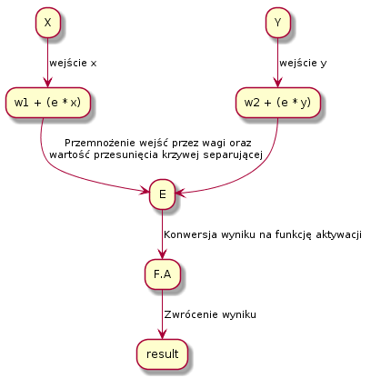
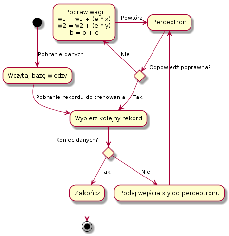

# **Modelowanie działania pojedyńczego perceptronu**
## **1. Cel ćwiczenia**
Napisać funkcję realizującą działanie pojedynczego perceptronu z dwoma wejściami, którego schemat przedstawiony jest na rysunku:

<!-- ```plantuml
@startuml
X -down-> [wejście x] w1 + (e * x)
Y -down-> [wejście y] w2 + (e * y)
"w1 + (e * x)" -down-> [ Przemnożenie wejść przez wagi oraz\nwartość przesunięcia krzywej separującej] E
"w2 + (e * y)" -down-> E
E -down-> [Konwersja wyniku na funkcję aktywacji] F.A
F.A -down-> [Zwrócenie wyniku] result
@enduml
``` -->


Zadaniem perceptronu będzie klasyfikacja dwóch zbiorów liniowo separowalnych na płaszczyźnie kartezjańskiej.

## **2. Rozwiązanie**

### ***Algorytm działania perceptronu***


### ***Wczytanie bazy wiedzy***
Do poprawnego przeprowadzenia treningu perceptronu niezbędna jest poprawna baza wiedzy z odpowiedziami:  

```python
# data for training
data_set = [
    [-8,20],  #1
    [4,25],   #2
    [5,9],    #3
    [2,20],   #4
    [1,-10],  #5
    [-6,-5],  #6
    [4,-16],  #7
    [-6,-25], #8
    [-9,-10], #9
    [-2,-10]  #10
]
```
```python
answer_set = [
    1, #1
    1, #2
    0, #3
    1, #4
    0, #5
    1, #6
    0, #7
    0, #8
    1, #9
    0, #10
]

# set random weight and offset
w1 = random.uniform(0, 1)
w2 = random.uniform(0, 1)
b  = random.uniform(0, 1)
```

### ***Trening perceptronu***
Dla każdej próbki danych sprawdzamy odpowiedź:

```python
def train(data, answer_key):
    global w1
    global w2
    global b
    for i in range(len(data)):
        e = 1
        while e != 0:
            activation = 0
            x = data[i][0]
            y = data[i][1]
            print "\nx", x, "y", y
            answer = (w1*x) + (w2*y) + b
            if answer > 0:
                activation = 1
            e = answer_key[i] - activation
            print "answer", round(answer,2), "=", activation
```

<div class="page"/>

### ***Walidacja odpowiedzi***
Jeżeli perceptron odpowiedział prawidłowo przechodzimy do następnej próbki danych, w przeciwnym wypadku następuje zmiana wag dla wejść X i Y oraz parametru przesunięcia.  

```python
if e != 0:
    print "wrong answer, change w1, w2, b and repeat"
    w1 = w1 + (e * x)
    w2 = w2 + (e * y)
    b = b + e
```

### ***Zakończenie procesu uczenia***
Po zakończonym procesie uczenia się perceptron otrzymuje dane spoza bazy wiedzy. Na tym etapie należy sprawdzić skuteczność układu, jeżeli jest ona niższa niż oczekiwana należy powtórzyć proces uczenia się:

```python
def check(x, y):
    global w1
    global w2
    global b
    activation = 0
    answer = (w1*x) + (w2*y) + b
    if answer > 0:
        activation = 1
    print "\nx", x, "y", y
    print round(answer,2), "answer", activation
```

## **3. Wnioski**

- Proces nauki perceptronu jest w dużej mierze zależny od bazy wiedzy.

- Im większymi zasobami danych dysponujemy tym proces trenowania będzie dokładniejszy.

- Należy zwrócić uwagę na fakt, że przy bardziej skomplikowanych konstrukcjach perceptronu byłoby wręcz wskazane określenie dodatkowych iteracji na próbkę danych np. analiza obrazu.

- Błędne wpisy bazy wiedzy mogą prowadzić do mylnie przeprowadzonego procesu uczenia.

- Popularnym zjawiskiem którego należy się wystrzegać przy projektowaniu sztucznych sieci neuronowych jest "Overfeeding".

- Osiągnięcie przez perceptron skuteczności rzędu 100% jest zależne od poziomu skomplikowania zadania.

<div class="page"/>

```
x -8 y 20
answer 5.96 = 1
x 4 y 25
answer 9.18 = 1
x 5 y 9
answer 4.11 = 1
wrong answer, change w1, w2, b and repeat
x 5 y 9
answer -102.89 = 0
x 2 y 20
answer -183.71 = 0
wrong answer, change w1, w2, b and repeat
x 2 y 20
answer 221.29 = 1
x 1 y -10
answer -115.6 = 0
x -6 y -5
answer -38.9 = 0
wrong answer, change w1, w2, b and repeat
x -6 y -5
answer 23.1 = 1
x 4 y -16
answer -135.15 = 0
x -6 y -25
answer -103.41 = 0
x -9 y -10
answer 18.07 = 1
x -2 y -10
answer -44.0 = 0

check perceptron after training
x -2 y 5
50.88 answer 1
x 1 y 4
17.95 answer 1
x 8 y 8
-18.82 answer 0
```